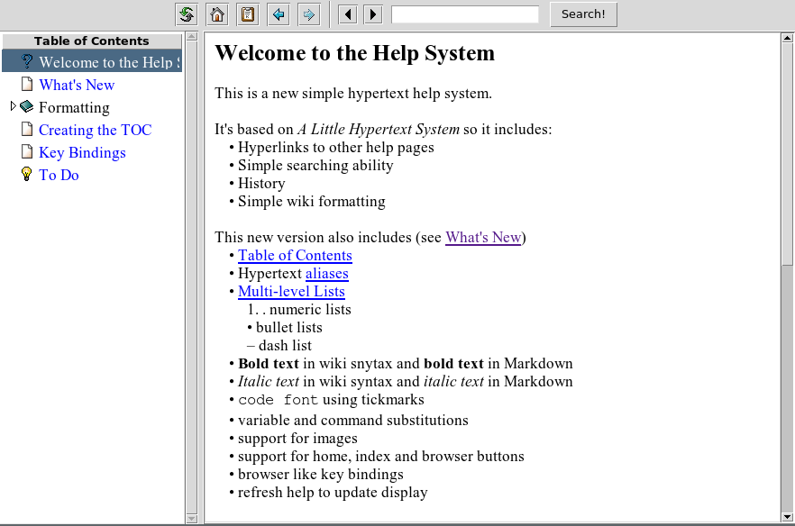

# hyperhelp

Tcl/Tk   package  do  display   Markdown   like  help  pages  in  your  Tcl/Tk
applications.

Features:

- multiple help pages and images as base64 encoded within the same file
-  partially   Markdown   compatible  syntax  (headers,  list,  bold,  italic,
  todo-list, images, ...)
- table of contents
- search and index facilities
- history functionality
- browser bar

* Manual [hyperhelp.html](https://htmlpreview.github.io/?https://raw.githubusercontent.com/mittelmark/hyperhelp/master/hyperhelp/hyperhelp.html)

All documentation is kept in a single file therefore  simplifying  application
delivery. Since version 1.0.0 it is as well possible to embed images within the
document  directly as base64 encodings,  allowing to combine all documentation
with images within the same file. The markup syntax is partially compatible with standard  Markdown  allowing to
generate  as well other  documentation  formats  like docx  documents  or html
documents  using the standard  document  processors,  for instance a tool like
pandoc.

Example:

```tcl
### load the package
package require hyperhelp
### set a helpfile filename
set helpfile [file join [file dirname [info script]] hyperhelp-docu.txt]
### initialize the widget
set hhelp [hyperhelp::hyperhelp .help -helpfile $helpfile]
### pack the widget and display it
pack $hhelp -side top -fill both -expand true
### browse a section in the help file
$hhelp help overview
```



Here   the   source   code   of the help page which   is   displayed   above   in  the   widget
[hyper-help-docu.txt](https://raw.githubusercontent.com/mittelmark/hyperhelp/main/hyperhelp/hyperhelp-docu.txt)

## Markup

Here a short example for the supported markup.

```
title: Hyperhelp Title Page
alias: main

Free text can be written here with standard *Markdown* 
or ''Wiki'' syntax markup.

------
title: Other Page title
alias: other
icon: acthelp16

Follows more text for tqhe second help page. You can link
to the [main] page here also.
------

## <a name="aliasname">Page title</a>

Text for the next page after this Markdown like header, the anchor is now an alis 
which  can be used for links  like here  [aliasname],  the link  [Page  title]
points to the same page.
```

There is support for  headers,  (indented)  lists, bold,  italics,  typewriter
style, hyperlinks, image display, code blocks and variable and command substitutions.

## Installation

Just download the [main.zip](https://github.com/mittelmark/hyperhelp/archive/refs/heads/main.zip)
file and  extract  the  hyperhelp  folder  within the zip  archive to a folder
belonging to your package path.

## Author

Detlef Groth, University of Potsdam, Germany

## License 

```
BSD 3-Clause License

Copyright (c) 2023, Detlef Groth, University of Potsdam, Germany

Redistribution and use in source and binary forms, with or without
modification, are permitted provided that the following conditions are met:

1. Redistributions of source code must retain the above copyright notice, this
   list of conditions and the following disclaimer.

2. Redistributions in binary form must reproduce the above copyright notice,
   this list of conditions and the following disclaimer in the documentation
   and/or other materials provided with the distribution.

3. Neither the name of the copyright holder nor the names of its
   contributors may be used to endorse or promote products derived from
   this software without specific prior written permission.

THIS SOFTWARE IS PROVIDED BY THE COPYRIGHT HOLDERS AND CONTRIBUTORS "AS IS"
AND ANY EXPRESS OR IMPLIED WARRANTIES, INCLUDING, BUT NOT LIMITED TO, THE
IMPLIED WARRANTIES OF MERCHANTABILITY AND FITNESS FOR A PARTICULAR PURPOSE ARE
DISCLAIMED. IN NO EVENT SHALL THE COPYRIGHT HOLDER OR CONTRIBUTORS BE LIABLE
FOR ANY DIRECT, INDIRECT, INCIDENTAL, SPECIAL, EXEMPLARY, OR CONSEQUENTIAL
DAMAGES (INCLUDING, BUT NOT LIMITED TO, PROCUREMENT OF SUBSTITUTE GOODS OR
SERVICES; LOSS OF USE, DATA, OR PROFITS; OR BUSINESS INTERRUPTION) HOWEVER
CAUSED AND ON ANY THEORY OF LIABILITY, WHETHER IN CONTRACT, STRICT LIABILITY,
OR TORT (INCLUDING NEGLIGENCE OR OTHERWISE) ARISING IN ANY WAY OUT OF THE USE
OF THIS SOFTWARE, EVEN IF ADVISED OF THE POSSIBILITY OF SUCH DAMAGE.
```


